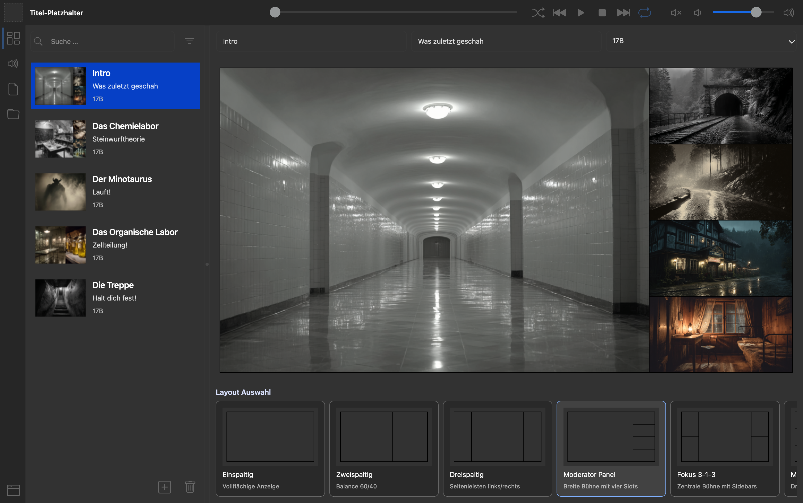

# SlideQuest

PySide6 prototype for building and presenting mixed-media slides. SlideQuest ships two coordinated windows—`MasterWindow` for control and `PresentationWindow` for projection—and keeps every UI string i18n-ready so the runtime language follows the OS locale. The entire codebase is produced by OpenAI Codex sessions and is licensed under the GNU GPL v3.

## Tooling & Commands

- **Runtime**: Python 3.12+, [uv](https://docs.astral.sh/uv/) for dependency management.
- **Install**: `uv sync` (creates `.venv` and installs PySide6 + dev tools).
- **One-off run**: `uv run slidequest` or `make run`.
- **Hot reload**: `uv run slidequest-dev` / `make dev` (watchfiles-based).
- **Add dependency**: `uv add <package>`.
- Prefer `rg` for file/text search; keep sources ASCII unless Unicode is already in use.
- **CI**: `.github/workflows/python.yml` installs uv, runs flake8, and executes pytest on every push/PR targeting `main`.

## Workspace Layout

- `src/slidequest/app.py` – thin entry point that wires Master/Presentation windows.
- `src/slidequest/models/…` – dataclasses for layouts and slides.
- `src/slidequest/viewmodels/…` – viewmodels (e.g., `MasterViewModel`) that mediate persistence and UI.
- `src/slidequest/services/storage.py` – JSON persistence helpers.
- `src/slidequest/views/master_window.py` – full `MasterWindow` implementation and supporting widgets.
- `src/slidequest/views/presentation_window.py` – secondary window that mirrors the active layout.
- `src/slidequest/views/widgets/layout_preview.py` – reusable layout canvas + cards.
- `src/slidequest/utils/media.py` – helpers for slug/asset path handling.
- `assets/` – design references + generated thumbnails (`assets/thumbnails/*.png`).
- `docs/assets/LayoutViewScreenshot.png` – latest UI snapshot used in documentation.
- `AGENTS.md` – operational rules for automation agents.



*MasterWindow anatomy: StatusBar, SymbolView (navigation), Explorer (header/main/footer), Detail view (header/main/footer + layout selection carousel).*

## Slides & Data Model

Slides live in `data/slides.json` and follow this structure:

```json
{
  "slides": [
    {
      "title": "My Slide",
      "subtitle": "Layout Example",
      "group": "My Group",
      "layout": {
        "active_layout": "2S|60:40/1R:100/1R:100",
        "thumbnail_url": "assets/thumbnails/example.png",
        "content": [
          "media/image.png",
          "media/photo.jpg",
          "media/video.mp4"
        ]
      },
      "audio": {
        "playlist": ["media/music.mp3"],
        "effects": ["media/effect.ogg"]
      },
      "notes": {
        "notebooks": ["notes/show.md"]
      }
    }
  ]
}
```

- `layout.content[i]` corresponds to area `#i+1` in the active layout description. Layout changes never delete surplus media; unused items reappear when a compatible layout is chosen again.
- Drag & drop in the Detail Preview updates `layout.content`, syncs the Presentation window, and captures a fresh thumbnail stored under `assets/thumbnails/<slug>.png`.
- Layout presets are defined in `src/slidequest/models/layouts.py`; each card in the Detail footer is built from these specs.

## Status & Navigation Surfaces

- **SymbolView** (left) exposes launchers for Layout, Audio, Notes, Files. Each button opens its sub-app inside Explorer + Detail views and shows a left accent when active.
- **StatusBar** (top) groups artwork/title placeholders, transport controls (shuffle, previous, play/pause, stop, next, loop), seek bar, and volume cluster (mute, down, slider, up). Buttons share the same styling primitives as SymbolView; active states use the palette accent color.
- **PresentationWindow** is hidden until explicitly launched via the window button anchored at the bottom of SymbolView. Only one presentation window exists at a time; once it closes, the launcher re-enables.

## Localization & Accessibility

- Every button, slider, or input has a tooltip exposing its unique ID to simplify references in documentation or automation.
- UI strings must be routed through the localization utilities established in `ui/constants.py` (planned), defaulting to the OS language.
- Icons from Bootstrap SVG packs (`assets/icons/bootstrap/<domain>/…`) must adapt to light/dark palettes: near-white in dark mode, near-black in light mode.

## Provenance & License

- SlideQuest is authored entirely by OpenAI Codex; no human-written legacy code remains.
- Source code is distributed under the **GNU General Public License v3.0**. See `LICENSE` for the full text and obligations when redistributing modified copies.
- Contributions should retain this license, respect the localization rules, and document changes in both README (en) and `Liesmich.md` (de).

## Git Workflow

1. **Sync & Branch** – Update `main` (`git pull origin main`) and start a feature branch (`git checkout -b feature/<topic>`). Avoid committing directly to `main`.
2. **Focused Work** – Keep change sets small, update documentation/localization alongside code, and surface large scopes before implementation.
3. **Test Locally** – Run `uv run slidequest` or `make dev`; add targeted checks for regressions when possible.
4. **Curate Staging** – Use `git status` plus `git add -p` to stage only intentional edits; generated assets (e.g., thumbnails) should be confirmed before inclusion.
5. **Commit Message** – Present-tense summary with context (“Add horizontal layout selector”). Reference related tasks if applicable.
6. **Push & Review** – `git push -u origin feature/<topic>` and open a PR against `main`, noting i18n/doc updates.
7. **Merge & Clean** – After review, merge (squash or fast-forward), delete the feature branch locally/remotely, and resync your workspace.
