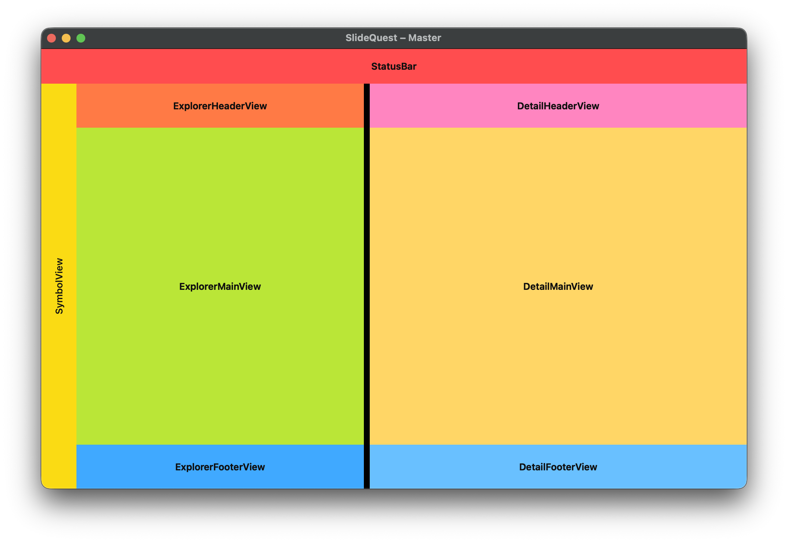
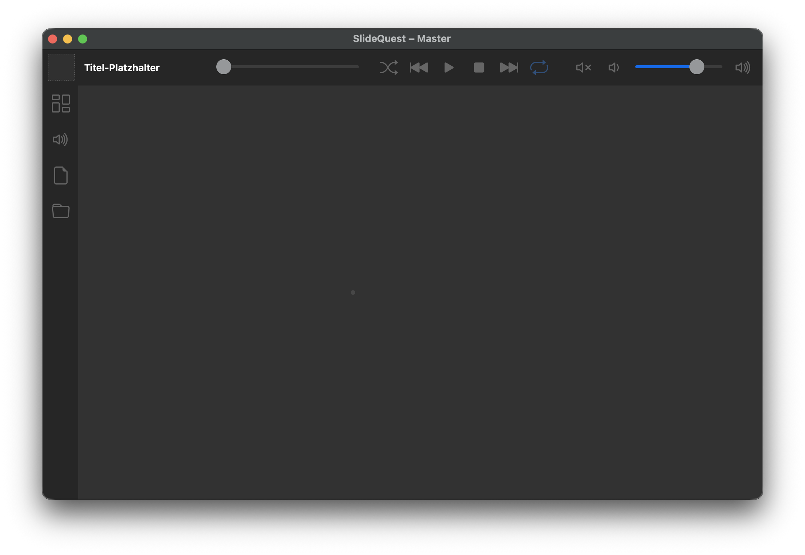
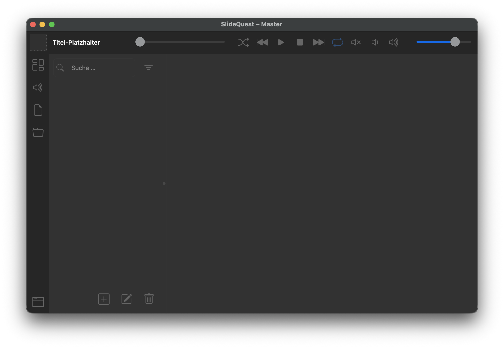

# SlideQuest Handbuch

> Dieses Handbuch ist die maßgebliche Referenz für alle Arbeiten an SlideQuest. Es folgt der Obsidian-Struktur; die deutschsprachige README im Projektstamm fasst die wichtigsten Punkte zusammen.

## Entwicklungsprinzipien

- Bevorzuge einfache Lösungen und halte die kognitive Komplexität so gering wie möglich.
- Teile Arbeit in kleine, wiederverwendbare Module auf und prüfe, ob Komponenten unabhängig funktionieren können.
- Kläre unklare Anforderungen sofort mit dem Auftraggeber, bevor Code entsteht.
- Große Features zuerst in `Tasks.md` festhalten, dann in prompt-gerechte Teilaufgaben splitten.
- Dokumentation immer unmittelbar aktualisieren (README + Handbuch).
- Benutzer-Dokumentation bleibt auf Deutsch (mit Umlauten), technische Texte (z. B. AGENTS, Code-Kommentare) auf Englisch.
- Alle Texte müssen i18n-kompatibel sein; zur Laufzeit orientiert sich die UI an der Systemsprache und schaltet entsprechend um.

## Tooling-Workflow

- Python 3.12 + `uv` verwalten Abhängigkeiten und Skripte (`uv add`, `uv sync`, `uv run …`). Alternativ stehen `make run|dev|sync` bereit.
- `watchfiles` sorgt für Hot-Reload via `uv run slidequest-dev`.
- Verwende `rg` für Suchen und halte Dateien ASCII-kompatibel, sofern keine Unicode-Zeichen benötigt werden.

## UI-Überblick



- `MasterWindow` ist die Steuerebene für Autorenfunktionen.
- `PresentationWindow` zeigt die Ausgabe; beide Fenster starten gemeinsam über `slidequest.main`.
- Der obige Screenshot visualisiert StatusBar, SymbolView sowie Explorer-/Detail-Spalten mitsamt Unterbereichen (Header/Main/Footer).

## SymbolView (Navigation)

Die SymbolView ist eine vertikale Navigationsleiste. Jeder Button öffnet eine eigene Sub-Anwendung im Explorer- und Detailbereich.

| Button | Symbol | Zweck |
| --- | --- | --- |
| LayoutExplorerLauncher |  | Layout-Übersicht und Layout-Einstellungen |
| AudioExplorerLauncher |  | Audio-Steuerung, z. B. Pegel & Wiedergabe |
| NoteExplorerLauncher |  | Notizverwaltung (Markdown, Textsnippets) |
| FileExplorerLauncher |  | Programmeigene Asset-Library für Bilder, Videos, Audiofiles und Markdown |

> Hinweis: Icons liegen als Bootstrap-SVGs unter `assets/icons/bootstrap/<kategorie>/`. Bei neuen Domains immer dort ablegen und im Handbuch/README erwähnen.



> Abbildung: Zusammenspiel aus SymbolView (links) und Statusbar (zentral/rechts) inklusive Seekbar, Transport-Buttons und Lautstärke.



> Ergänzt um ExplorerHeaderView (Search/Filter) und ExplorerFooterView (CRUD).

## Explorer Controls

- `ExplorerSearchInput` + `ExplorerFilterButton` leben im ExplorerHeaderView und nutzen die Bootstrap-Icons `search`/`filter` (siehe `assets/icons/bootstrap/actions/`).
- Der ExplorerFooterView stellt CRUD bereit (derzeit `ExplorerCreateButton`, `ExplorerDeleteButton`), weitere Aktionen werden bei Bedarf ergänzt.

## Datenmodell & Persistenz

Die verfügbaren Slides wohnen in `data/slides.json`. Jede Folie folgt exakt dieser Struktur:

```json
{
  "slides": [
    {
      "title": "My Slide",
      "subtitle": "Layout Example",
      "group": "My Group",
      "layout": {
        "active_layout": "2S|60:40/1R:100/1R:100",
        "thumbnail_url": "relative/path/to/thumbnail.png",
        "content": [
          "relative/path/to/image.png",
          "relative/path/to/image.jpg",
          "relative/path/to/movie.mp4"
        ]
      },
      "audio": {
        "playlist": [
          "relative/path/to/music.mp3",
          "relative/path/to/track.ogg"
        ],
        "effects": [
          "relative/path/to/effect.mp3",
          "relative/path/to/effect2.ogg"
        ]
      },
      "notes": {
        "notebooks": [
          "relative/path/to/notebook.md",
          "relative/path/to/notebook2.md"
        ]
      }
    }
  ]
}
```

- `ExplorerMainView` zeigt die Slides mit Titel, Untertitel, Gruppe sowie einem Thumbnail, das beim letzten Speichern direkt aus dem `PresentationWindow` gerendert wurde.
- Die `LayoutSelectionList` enthält alle verfügbaren Layouts (`LAYOUT_ITEMS`). Ein Wechsel aktualisiert `layout.active_layout`, bereinigt unpassende Bildzuweisungen und erzeugt automatisch ein neues Thumbnail (`assets/thumbnails/<slug>.png`).
- Immer wenn ein Layout gewechselt wird oder der Nutzer per Drag & Drop ein Bild ersetzt, wird das `PresentationWindow` off-screen gerendert, der Screenshot gespeichert und der Pfad (`thumbnail_url`) im JSON aktualisiert.
- Medienpfade, Audio-Playlisten sowie Notiz-Notebooks bleiben relative Pfade, damit Projekte portabel bleiben. Alle Texte müssen i18n-kompatibel bleiben; zur Laufzeit richtet sich die Sprachwahl nach der Systemsprache.

## Verzeichnisleitfaden

- `src/slidequest/app.py` – Einstiegspunkt, Fensteraufbau, SymbolView-Logik.
- `src/slidequest/dev.py` – Watchfiles-Orchestrierung für den Dev-Loop.
- `AGENTS.md` – technische Vorgaben für KI-Agenten.
- `docs/` – Obsidian-Vault mit diesem Handbuch.
- `tasks.md` – Backlog für mehrschrittige Arbeiten.
- `assets/` – Referenzmaterial (z. B. MasterWindow_GeneralLayout.png, Icons).
- `MTMT*` – Legacy-Applikation; bleibt unverändert, außer ausdrücklich gefordert.

## Kollaboration

- Neue Konventionen zuerst hier dokumentieren, danach die README synchronisieren.
- Session-Ende: TODOs, Blocker oder offene Fragen klar benennen.
- Keine destruktiven Git-Befehle ohne ausdrückliche Freigabe; `MTMT/` enthält ein eigenes Repo und bleibt unberührt.
- Wenn Tools unerwartet Dateien anpassen, sofort stoppen und Rücksprache halten.
